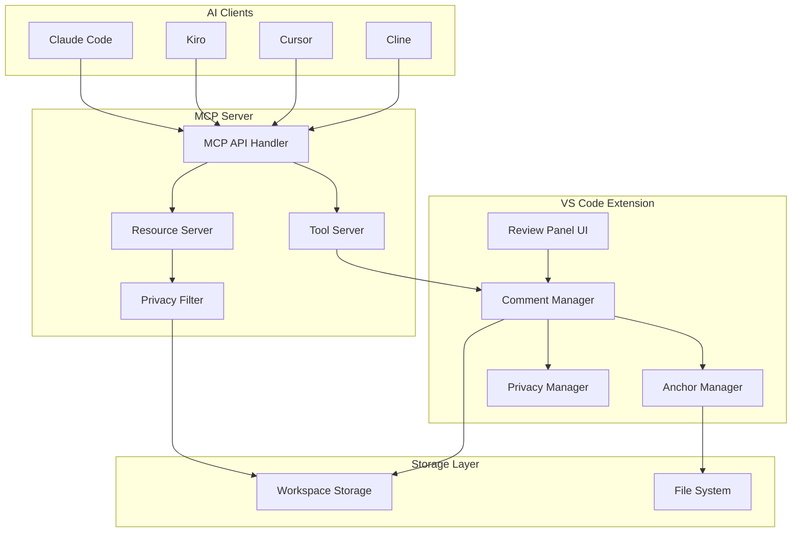

# Design Document

## Overview

The AI × Human Review Comments Layer is a VS Code extension that provides a unified review workflow system. The architecture consists of two main components: a VS Code extension for the user interface and comment management, and an MCP (Model Context Protocol) server for AI integration. The system uses a git diff-style anchor mechanism for code binding, implements a draft/published comment system for privacy control, and provides a structured comment threading system for human-AI collaboration.

## Architecture

### High-Level Architecture



### Component Interaction Flow

1. **Comment Creation**: User creates comments through VS Code UI → Comment Manager stores with anchors in draft state
2. **Comment Publishing**: User publishes draft comments → Privacy Manager updates visibility → MCP exposes as resource
3. **AI Processing**: AI clients read published comments via MCP resources → Process comments → Write back via MCP tools
4. **Human Review**: User reviews AI responses → Updates status → Continues iteration loop

## Components and Interfaces

### 1. VS Code Extension Components

#### Review Panel UI (`src/ui/ReviewPanel.ts`)
- **Purpose**: Main user interface for comment management with draft/published state handling
- **Responsibilities**:
  - Render comment list with filtering capabilities (including draft/published filters)
  - Display comment details and threads with visual distinction for draft comments
  - Handle user interactions (create, publish, resolve, reply)
  - Manage draft-to-published transitions
- **Key Methods**:
  - `renderCommentList(filters: CommentFilters): void`
  - `showCommentDetails(commentId: string): void`
  - `handlePublishComment(commentId: string): void`
  - `toggleDraftVisibility(showDrafts: boolean): void`

#### Comment Manager (`src/core/CommentManager.ts`)
- **Purpose**: Core business logic for comment lifecycle management with draft/published states
- **Responsibilities**:
  - CRUD operations for comments with privacy state management
  - Status management and transitions (draft → open → needs_review → resolved)
  - Thread management (human/AI/system messages)
  - Integration with storage layer and privacy controls
- **Key Methods**:
  - `createComment(anchor: CodeAnchor, content: string): Comment` (creates as draft)
  - `publishComment(commentId: string): void`
  - `updateCommentStatus(commentId: string, status: CommentStatus): void`
  - `addThreadMessage(commentId: string, message: ThreadMessage): void`
  - `getPublishedComments(filters?: CommentFilters): Comment[]`

#### Anchor Manager (`src/core/AnchorManager.ts`)
- **Purpose**: Handle code-to-comment binding using git diff strategy
- **Responsibilities**:
  - Create and validate code anchors
  - Detect anchor status changes (active/moved/outdated)
  - Provide navigation to anchored code locations
- **Key Methods**:
  - `createAnchor(uri: string, selection: Range): CodeAnchor`
  - `validateAnchor(anchor: CodeAnchor): AnchorStatus`
  - `navigateToAnchor(anchor: CodeAnchor): boolean`

#### Privacy Manager (`src/core/PrivacyManager.ts`)
- **Purpose**: Handle draft/published state management and AI access control
- **Responsibilities**:
  - Control which comments are visible to AI systems
  - Manage draft-to-published transitions
  - Filter comment data for MCP server exposure
  - Maintain privacy boundaries between draft and published content
- **Key Methods**:
  - `isCommentPublished(commentId: string): boolean`
  - `publishComment(commentId: string): void`
  - `getPublishedComments(filters?: CommentFilters): Comment[]`
  - `filterForAIAccess(comments: Comment[]): Comment[]`

### 2. MCP Server Components

#### Resource Server (`src/mcp/ResourceServer.ts`)
- **Purpose**: Expose only published comment data as MCP resources for AI consumption
- **Responsibilities**:
  - Serve published comment resources at defined endpoints
  - Filter out draft comments from all AI-accessible endpoints
  - Provide individual and bulk comment data export
  - Handle resource queries with filtering while respecting privacy boundaries
- **Resource Endpoints**:
  - `comments://open` - All open published comments
  - `comments://all` - All published comments regardless of status
  - `comments://comment/<commentId>` - Individual published comment details
  - `comments://export` - Structured export of all published comments

#### Tool Server (`src/mcp/ToolServer.ts`)
- **Purpose**: Provide MCP tools for AI to interact with published comment system
- **Responsibilities**:
  - Handle AI reply posting to published comments only
  - Manage comment status updates for published comments
  - Provide comment querying capabilities with privacy filtering
  - Export published comments in structured formats
- **Available Tools**:
  - `list_comments({status?, uri?, tags?})` - Returns only published comments
  - `post_ai_reply({commentId, content, meta?})` - Only works on published comments
  - `set_comment_status({commentId, status})` - Only affects published comments
  - `export_comments({format?, filters?})` - Export published comments for AI analysis

#### MCP API Handler (`src/mcp/MCPHandler.ts`)
- **Purpose**: Main MCP protocol implementation and request routing
- **Responsibilities**:
  - Handle MCP protocol communication
  - Route requests to appropriate servers
  - Manage authentication and error handling
- **Key Methods**:
  - `handleResourceRequest(request: MCPResourceRequest): MCPResponse`
  - `handleToolCall(request: MCPToolRequest): MCPResponse`

### 3. Storage Layer

#### Workspace Storage (`src/storage/WorkspaceStorage.ts`)
- **Purpose**: Persist comment data within workspace
- **Responsibilities**:
  - Store and retrieve comment data
  - Handle data migrations and versioning
  - Provide atomic operations for data consistency
- **Storage Location**: `.vscode/ai-review-comments/`
- **Key Methods**:
  - `saveComment(comment: Comment): void`
  - `loadComments(): Comment[]`
  - `saveBatch(batch: Batch): void`

## Data Models

### Core Data Structures

```typescript
interface Comment {
  id: string;
  uri: string;
  anchor: CodeAnchor;
  status: CommentStatus;
  isDraft: boolean;
  thread: ThreadMessage[];
  createdAt: Date;
  updatedAt: Date;
  publishedAt?: Date;
  tags?: string[];
}

interface CodeAnchor {
  snippet: string;
  normalized: string;
  range: Range;
  anchorStatus: AnchorStatus;
  contextLines: number;
}

interface ThreadMessage {
  id: string;
  role: 'human' | 'ai' | 'system';
  content: string;
  timestamp: Date;
  metadata?: Record<string, any>;
}

type CommentStatus = 'draft' | 'open' | 'needs_review' | 'resolved' | 'outdated';
type AnchorStatus = 'active' | 'moved' | 'outdated' | 'ambiguous';
```

### MCP Protocol Schemas

```typescript
interface MCPCommentResource {
  uri: string;
  name: string;
  description: string;
  mimeType: 'application/json';
  content: {
    comment: Comment; // Only published comments
    codeContext: string;
    fileContent?: string;
  };
}

interface MCPExportResource {
  uri: string;
  name: string;
  description: string;
  mimeType: 'application/json';
  content: {
    comments: Comment[]; // All published comments
    metadata: {
      exportedAt: Date;
      totalCount: number;
      filters?: Record<string, any>;
    };
  };
}
```

## Error Handling

### Error Categories and Strategies

#### 1. Anchor Resolution Errors
- **Scenario**: Code snippet cannot be found due to file changes
- **Strategy**: Mark as outdated, preserve data, allow manual re-anchoring
- **Implementation**: Graceful degradation with clear user feedback

#### 2. MCP Communication Errors
- **Scenario**: AI client connection issues or protocol errors
- **Strategy**: Retry with exponential backoff, queue operations, provide status feedback
- **Implementation**: Circuit breaker pattern with fallback modes

#### 3. Storage Errors
- **Scenario**: File system access issues or data corruption
- **Strategy**: Backup and recovery mechanisms, data validation
- **Implementation**: Atomic operations with rollback capabilities

#### 4. Privacy Boundary Violations
- **Scenario**: Attempt to access draft comments through MCP or expose private data
- **Strategy**: Strict filtering at MCP layer, audit logging, fail-safe defaults
- **Implementation**: Privacy filter with whitelist approach for published content

### Error Recovery Mechanisms

```typescript
interface ErrorRecovery {
  retryPolicy: {
    maxAttempts: number;
    backoffStrategy: 'exponential' | 'linear';
    baseDelay: number;
  };
  fallbackActions: {
    onAnchorFailure: 'mark_outdated' | 'prompt_user';
    onMCPFailure: 'queue_operation' | 'notify_user';
    onStorageFailure: 'use_memory' | 'prompt_backup';
    onPrivacyViolation: 'deny_access' | 'log_attempt';
  };
}
```

## Testing Strategy

### Unit Testing
- **Framework**: Jest with TypeScript support
- **Coverage**: All core business logic components
- **Focus Areas**:
  - Comment lifecycle management
  - Anchor validation and resolution
  - MCP protocol handling
  - Data persistence operations

### Integration Testing
- **Scope**: Component interaction testing
- **Key Scenarios**:
  - End-to-end comment creation to AI response flow
  - Draft-to-published comment workflow
  - MCP server-client communication with privacy filtering
  - Storage layer integration

### VS Code Extension Testing
- **Framework**: VS Code Extension Test Runner
- **Areas**:
  - UI component rendering and interaction
  - Command registration and execution
  - Workspace integration
  - Extension activation/deactivation

### MCP Server Testing
- **Approach**: Mock AI client interactions
- **Scenarios**:
  - Resource serving accuracy with privacy filtering
  - Tool execution correctness on published comments only
  - Protocol compliance
  - Error handling robustness
  - Privacy boundary enforcement

### Test Data Management
- **Strategy**: Fixture-based test data with realistic code samples
- **Isolation**: Each test uses isolated workspace and storage
- **Cleanup**: Automatic test environment cleanup after execution

## Performance Considerations

### Scalability Targets
- **Comments**: Support up to 1000 active comments per workspace (including drafts)
- **Published Comments**: Handle up to 500 published comments efficiently for AI access
- **Response Time**: UI operations under 100ms, MCP operations under 500ms
- **Memory Usage**: Keep extension memory footprint under 50MB

### Optimization Strategies
- **Lazy Loading**: Load comment details on-demand
- **Caching**: Cache frequently accessed data with TTL
- **Debouncing**: Debounce UI updates and file system operations
- **Pagination**: Implement pagination for large comment lists

### Resource Management
- **File Watching**: Efficient file system monitoring for anchor validation
- **Memory Cleanup**: Proper disposal of VS Code resources and event listeners
- **Connection Pooling**: Reuse MCP connections where possible