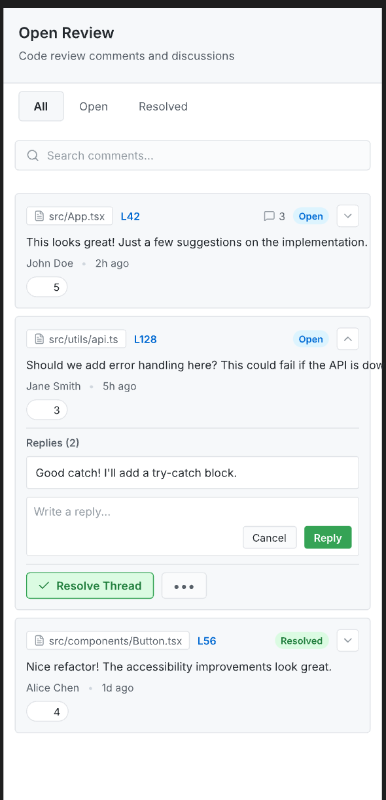

# Open Review

<div align="center">


**A modern VS Code extension for managing code review comments and discussions**

[](https://code.visualstudio.com/)
[](LICENSE)

[Features](#features) • [Installation](#installation) • [Usage](#usage) • [Commands](#commands) • [Development](#development)

</div>

---

## Overview

Open Review transforms code review into a **first-class VS Code experience**. Add threaded comments directly in your editor, manage discussions in a beautiful sidebar panel, and export everything with one click.

Perfect for:
- 📝 **Code reviews** - Add inline comments and track discussions
- 🤖 **AI workflows** - Export comments to feed into AI coding tools (Cursor, Cline, Claude, etc.)
- 📚 **Documentation** - Keep review notes alongside your code
- 👥 **Team collaboration** - Share structured feedback in Markdown format

---

## Features

### 🎨 Beautiful Sidebar Panel

A modern, theme-aware interface that seamlessly integrates with VS Code.

#### Panel Layout

**Header Section:**
- **Title**: "Open Review" in bold
- **Subtitle**: "Code review comments and discussions"
- Clean separation with subtle border

**Filter Tabs:**
- **All** - View every comment thread (active tab highlighted)
- **Open** - Active discussions needing attention
- **Resolved** - Completed threads for reference
- Active tab has background color, inactive tabs are text-only

**Search Bar:**
- 🔍 Search icon on the left
- Placeholder: "Search comments..."
- Rounded corners with subtle border
- Real-time filtering as you type

**Thread Cards:**

Each card displays comprehensive information:

| Element | Description | Example |
|---------|-------------|---------|
| 📁 **File Badge** | Clickable filename with icon | `src/App.tsx` |
| 📍 **Line Number** | Blue link to code location | `L42` |
| 💬 **Reply Count** | Number of comments | `3` |
| 🏷️ **Status Badge** | Open (blue) or Resolved (green) | `Open` / `Resolved` |
| ⬇️ **Expand Icon** | Chevron to show/hide details | `▼` / `▲` |
| 📝 **Comment Text** | Main comment content | Full text preview |
| 👤 **Author** | Comment author name | `John Doe` |
| 🕐 **Timestamp** | Relative time | `2h ago` |
| 👍 **Reactions** | Emoji reactions with counts | `👍 5` `❤️ 2` |

**Expanded Thread View:**

When you expand a thread, you see:
- **Full comment text** with proper formatting
- **Replies section** with "Replies (2)" header
- **Individual replies** in nested cards with:
  - Reply text
  - Author name and timestamp
  - Reaction counts
- **Reply input box** with:
  - "Write a reply..." placeholder
  - Cancel and Reply buttons
  - Reply button in accent color (blue/green)
- **Action buttons**:
  - ✅ "Resolve Thread" button (green) for open threads
  - "Reopen Thread" button for resolved threads
  - ••• More options menu

**Theme Adaptation:**

The panel automatically matches your VS Code theme:

**Dark Theme:**
- Background: Dark gray (`#1e1e1e`)
- Cards: Slightly lighter gray (`#2d2d30`)
- Text: Light gray (`#cccccc`)
- Accents: VS Code blue (`#007acc`)
- Borders: Subtle gray (`#3e3e42`)

**Light Theme:**
- Background: White (`#ffffff`)
- Cards: Light gray (`#f6f8fa`)
- Text: Dark gray (`#24292e`)
- Accents: GitHub blue (`#0366d6`)
- Borders: Light gray (`#e1e4e8`)

**Visual Examples from Design:**

The screenshots above show real examples:
- **Thread 1**: `src/App.tsx` at `L42` - Open thread with 3 replies
  - Comment: "This looks great! Just a few suggestions on the implementation."
  - Author: John Doe • 2h ago
  - Reactions: 👍 5, ❤️ 2

- **Thread 2**: `src/components/Button.tsx` at `L128` - Open thread (expanded)
  - Comment: "Should we add error handling here? This could fail if the API is down."
  - Author: Jane Smith • 5h ago
  - Shows reply system with "Write a reply..." input
  - Green "Resolve Thread" button visible

- **Thread 3**: `src/components/Button.tsx` at `L56` - Resolved thread
  - Comment: "Nice refactor! The accessibility improvements look great."
  - Author: Alice Chen • 1d ago
  - Green "Resolved" badge indicating completed discussion

---

## Features

## Features

### 🎨 Beautiful Sidebar Panel


The sidebar panel provides a comprehensive view of all your code review comments with:

- ✨ **Automatic theme detection** - Seamlessly matches VS Code's light/dark theme
- 🔍 **Instant search** - Find comments across all files in real-time
- 🏷️ **Smart filtering** - View All, Open, or Resolved threads
- 📊 **Status indicators** - Color-coded badges for thread status
- 💬 **Reply system** - Add and view replies without leaving the sidebar
- 🎯 **Quick navigation** - Click any file badge to jump to code location
- ⚡ **Expand/collapse** - Show or hide thread details on demand

---

### 🎯 Inline Comment Threads

Create comment threads directly in your code editor using VS Code's native Comments API:

```typescript
// Click the line gutter or select code
function calculateTotal(items: Item[]) {
  // 💬 Comment thread appears here
  return items.reduce((sum, item) => sum + item.price, 0);
}
```

**Features:**
- Click any line or select a range to add a comment
- Native VS Code Comments UI integration
- Thread-based discussions with replies
- Line number tracking and navigation
- Persistent across editor sessions

### 🔍 Smart Search & Filtering

Find exactly what you need:

**Search Bar:**
- Search across all comment threads
- Matches file names, line numbers, and comment content
- Real-time filtering as you type

**Filter Tabs:**
- **All** - View every comment thread
- **Open** - Active discussions needing attention
- **Resolved** - Completed threads for reference

### 💬 Thread Management

Each thread card shows:

| Element | Description |
|---------|-------------|
| 📁 **File Badge** | Clickable filename (e.g., `src/App.tsx`) |
| 📍 **Line Number** | Jump to exact location (e.g., `L42`) |
| 💬 **Reply Count** | Number of comments in thread |
| 🏷️ **Status Badge** | Open (blue) or Resolved (green) |
| ⬇️ **Expand Button** | Show/hide thread details |

**When Expanded:**
- View all replies in chronological order
- Add new replies with inline input
- Resolve or reopen threads
- See author names and timestamps
- Navigate to code location with one click

### 📤 Export to Markdown

Export all comments with a single click - perfect for sharing or feeding into AI tools:

**Export Format:**
```markdown
## File: src/components/Button.tsx

### Thread @ L56
**Status:** Open | **Replies:** 2

**John Doe** (2h ago):
> This looks great! Just a few suggestions on the implementation.

**Jane Smith** (1h ago):
> Good catch! I'll add a try-catch block.

---

## File: src/utils/api.ts

### Thread @ L128
**Status:** Resolved | **Replies:** 3

**Alice Chen** (5h ago):
> Should we add error handling here? This could fail if the API is down.

**Bob Wilson** (3h ago):
> Agreed, I'll implement proper error boundaries.
```

**What's Included:**
- ✅ File paths and line numbers
- ✅ Thread status (Open/Resolved)
- ✅ All comments and replies
- ✅ Author names and timestamps
- ✅ Chronological order
- ✅ Markdown formatting for easy sharing

**Use Cases:**
- Share in Slack, GitHub issues, or documentation
- Feed into AI coding assistants (Cursor, Cline, Claude)
- Archive review discussions
- Generate review reports
- Create documentation from comments

### 🎨 Theme Support

Automatically adapts to your VS Code theme:

**Dark Theme Colors:**
- Background: `#1e1e1e` (VS Code dark)
- Cards: `#2d2d30`
- Text: `#cccccc`
- Accents: `#007acc` (VS Code blue)
- Borders: `#3e3e42`

**Light Theme Colors:**
- Background: `#ffffff`
- Cards: `#f6f8fa`
- Text: `#24292e`
- Accents: `#0366d6`
- Borders: `#e1e4e8`

No configuration needed - it just works!

---

## Installation

### From VSIX (Current)

1. Download `open-review-0.0.4.vsix`
2. Open VS Code
3. Go to Extensions (`Cmd+Shift+X` / `Ctrl+Shift+X`)
4. Click `...` → `Install from VSIX...`
5. Select the downloaded file

### From Marketplace (Coming Soon)

Search for "Open Review" in the VS Code Extensions marketplace.

---

## Usage

### Creating Comments

**Method 1: Click Line Gutter**
1. Open any file in your workspace
2. Click the line number gutter where you want to comment
3. Click the `+` icon that appears
4. Type your comment
5. Press `Cmd+Enter` (Mac) or `Ctrl+Enter` (Windows/Linux) to submit

**Method 2: Select Code Range**
1. Select multiple lines of code
2. Right-click and choose "Add Comment" or click the `+` icon
3. Type your comment about the selected code
4. Submit with `Cmd+Enter` / `Ctrl+Enter`

**Method 3: Command Palette**
1. Place cursor on desired line or select code
2. Open Command Palette (`Cmd+Shift+P` / `Ctrl+Shift+P`)
3. Type "Open Review: Create Comment"
4. Enter your comment

### Managing Threads in Sidebar

**Opening the Sidebar:**
- Click the Open Review icon in the Activity Bar (left sidebar)
- Or use Command Palette: "Open Review: Focus on Open Review View"

**Searching Comments:**
```
┌─────────────────────────────────┐
│ 🔍 Search comments...           │
└─────────────────────────────────┘
```
- Type to search across all threads
- Searches file names, line numbers, and comment text
- Results update in real-time

**Filtering Threads:**
```
[All]  [Open]  [Resolved]
 ^^^
Active filter shown with background
```
- **All** - Shows every thread (default)
- **Open** - Only active discussions
- **Resolved** - Completed threads

**Navigating to Code:**
1. Find the thread in the sidebar
2. Click the file badge (e.g., `📁 src/App.tsx`)
3. Editor jumps to the exact line
4. Comment thread is highlighted

**Expanding Threads:**
1. Click the expand button (⬇️) on any thread card
2. View all replies and details
3. Click again (⬆️) to collapse

**Adding Replies:**
1. Expand the thread
2. Click the "Reply" button at the bottom
3. Type your reply in the input box
4. Click "Reply" button or press `Cmd+Enter` / `Ctrl+Enter`
5. Click "Cancel" to discard

**Resolving Threads:**
1. Expand the thread
2. Scroll to the bottom
3. Click "✅ Resolve Thread" button
4. Status changes to "Resolved" (green badge)

**Reopening Threads:**
1. Filter to show "Resolved" threads
2. Expand the resolved thread
3. Click "Reopen Thread" button
4. Status changes back to "Open" (blue badge)

### Exporting Comments

**Quick Export (Recommended):**
1. Click the export icon (📤) in the editor title bar
2. All comments are copied to clipboard as Markdown
3. Notification shows: "Exported X comments to clipboard"
4. Paste anywhere: Slack, docs, AI tools, etc.

**Via Command Palette:**
1. Open Command Palette (`Cmd+Shift+P` / `Ctrl+Shift+P`)
2. Type "Open Review: Export Comments"
3. Press Enter
4. Comments copied to clipboard

**Export Output Example:**
```markdown
## File: src/App.tsx

### Thread @ L42
**Status:** Open | **Replies:** 3

**John Doe** (2h ago):
> This looks great! Just a few suggestions on the implementation.

**Jane Smith** (1h ago):
> Thanks! What specifically should I change?

**John Doe** (30m ago):
> Consider extracting this logic into a separate function.
```

### Deleting Comments

**Delete Individual Comment:**
1. Hover over the comment in the editor
2. Click the `...` menu
3. Select "Delete Comment"
4. Confirm deletion

**Delete Entire Thread:**
1. Open the thread in the editor
2. Click the trash icon in the thread header
3. Confirm deletion
4. All comments in the thread are removed

---

## Commands

All available commands in the Command Palette (`Cmd+Shift+P` / `Ctrl+Shift+P`):

| Command | Description | When Available |
|---------|-------------|----------------|
| `Open Review: Create Comment` | Create a new comment thread at cursor/selection | Always |
| `Open Review: Export Comments` | Export all threads to clipboard as Markdown | Always |
| `Open Review: Reply Comment` | Add a reply to the current thread | In comment thread |
| `Open Review: Delete Comment` | Delete a specific comment | On comment |
| `Open Review: Edit Comment` | Edit an existing comment | On comment |
| `Open Review: Save Comment` | Save comment changes | While editing |
| `Open Review: Cancel Save Comment` | Discard comment changes | While editing |
| `Open Review: Start Draft` | Begin a draft comment | In empty thread |
| `Open Review: Finish Draft` | Complete and post draft | In draft mode |

### Context Menu Commands

**In Editor Gutter:**
- Right-click line number → "Add Comment"

**In Comment Thread:**
- "Reply" - Add a reply to the thread
- "Delete Thread" - Remove entire thread
- "Edit" - Modify your comment
- "Delete Comment" - Remove single comment

**In Sidebar:**
- Click file badge → Navigate to code
- Click expand button → Show/hide details
- Click "Reply" → Add reply
- Click "Resolve Thread" → Mark as resolved
- Click "Reopen Thread" → Mark as open

---

## Keyboard Shortcuts

| Action | Shortcut | Context |
|--------|----------|---------|
| Submit comment | `Cmd+Enter` / `Ctrl+Enter` | While typing comment |
| Cancel editing | `Escape` | While typing comment |
| Open Command Palette | `Cmd+Shift+P` / `Ctrl+Shift+P` | Always |
| Focus sidebar | Click Activity Bar icon | Always |

---

## Configuration

Open Review works out of the box with **zero configuration required**.

### Automatic Features

✅ **Theme Detection** - Automatically matches VS Code's light/dark theme  
✅ **Color Adaptation** - Uses VS Code's color scheme  
✅ **Font Settings** - Inherits editor font preferences  
✅ **Workspace Persistence** - Comments saved per workspace  
✅ **Real-time Updates** - Sidebar syncs with editor changes  

### Customization (Future)

Currently, Open Review uses sensible defaults. Future versions will support:
- Custom export templates
- Configurable keyboard shortcuts
- Custom status labels
- Team member avatars
- Notification preferences

---

## Roadmap

### v0.1.0 - Enhanced Export
- [ ] Export to JSON format
- [ ] Export to file (not just clipboard)
- [ ] Filter export (unresolved only, by file, etc.)
- [ ] Custom export templates

### v0.2.0 - Advanced Features
- [ ] Emoji reactions on comments
- [ ] @mentions for team collaboration
- [ ] Comment attachments (images, code snippets)
- [ ] Thread labels/tags

### v0.3.0 - AI Integration
- [ ] MCP server for AI tool integration
- [ ] Send selected threads to coding agents
- [ ] AI-powered comment suggestions
- [ ] Automated review summaries

### v0.4.0 - Persistence & Sync
- [ ] Save comments to workspace
- [ ] Git integration (link to commits)
- [ ] Team sync via cloud storage
- [ ] Import/export project reviews

---

## Development

### Prerequisites

- Node.js 16.x or higher
- npm or pnpm
- VS Code 1.74.0 or higher

### Setup

```bash
# Clone the repository
git clone https://github.com/yuhang-dong/open-review.git
cd open-review

# Install dependencies
npm install

# Build the extension
npm run build:all
```

### Development Workflow

```bash
# Watch mode for extension code
npm run watch

# Watch mode for webview (in separate terminal)
npm run dev:webview

# Type checking
npm run type-check:all

# Lint
npm run lint
```

### Testing

1. Press `F5` in VS Code to launch Extension Development Host
2. Open a file and create some comments
3. Test the sidebar panel and export functionality
4. Check theme switching (light/dark)

### Building VSIX

```bash
# Build and package
npm run package

# This creates open-review-x.x.x.vsix
```

---

## Architecture

```
open-review/
├── src/
│   ├── extension.ts          # Extension entry point
│   ├── sidebar/              # Webview sidebar provider
│   ├── utils/                # Thread & comment management
│   └── webview/              # React-based UI
│       ├── components/       # UI components
│       ├── hooks/            # React hooks
│       └── types/            # TypeScript types
├── asserts/                  # Icons and assets
└── docs/                     # Design files (.pen)
```

**Key Technologies:**
- TypeScript for type safety
- React for webview UI
- Vite for fast builds
- VS Code Comments API
- CSS custom properties for theming

---

## Contributing

Contributions are welcome! Please feel free to submit a Pull Request.

1. Fork the repository
2. Create your feature branch (`git checkout -b feature/amazing-feature`)
3. Commit your changes (`git commit -m 'Add amazing feature'`)
4. Push to the branch (`git push origin feature/amazing-feature`)
5. Open a Pull Request

---

## License

This project is licensed under the MIT License - see the [LICENSE](LICENSE) file for details.

---

## Acknowledgments

- Built with ❤️ for the VS Code community
- Inspired by GitHub's code review experience
- Designed for modern development workflows

---


<div align="center">

**Dark Theme**


**Light Theme**



</div>

<div align="center">

**[⬆ back to top](#open-review)**

Made with ☕ by [Yuhang Dong](https://github.com/yuhang-dong)

</div>
